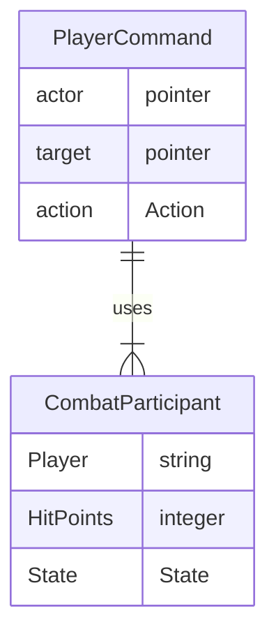
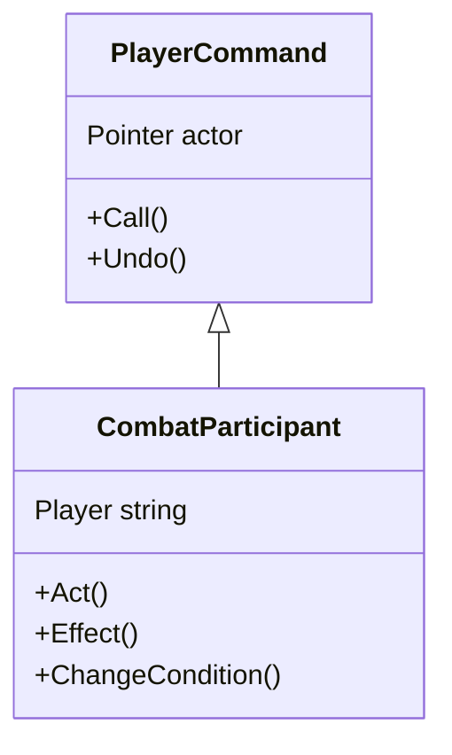

# combat

Combat diagrams

```mermaid
erDiagram
    PlayerCommand ||--|{ CombatParticipant: uses
    PlayerCommand  {
        actor pointer
        target pointer
        action Action
    }
    CombatParticipant {
        Player string
        HitPoints integer 
        State State
    }
```

Combat diagrams 2

```mermaid
classDiagram
    class PlayerCommand
    PlayerCommand: Pointer actor 
    PlayerCommand: +Call()
    PlayerCommand: +Undo()

    class CombatParticipant
    CombatParticipant: Player string
    CombatParticipant: +Act()
    CombatParticipant: +Effect()
    CombatParticipant: +ChangeCondition()

    PlayerCommand <|-- CombatParticipant
```