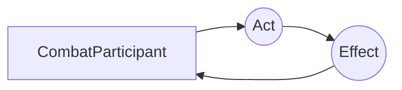
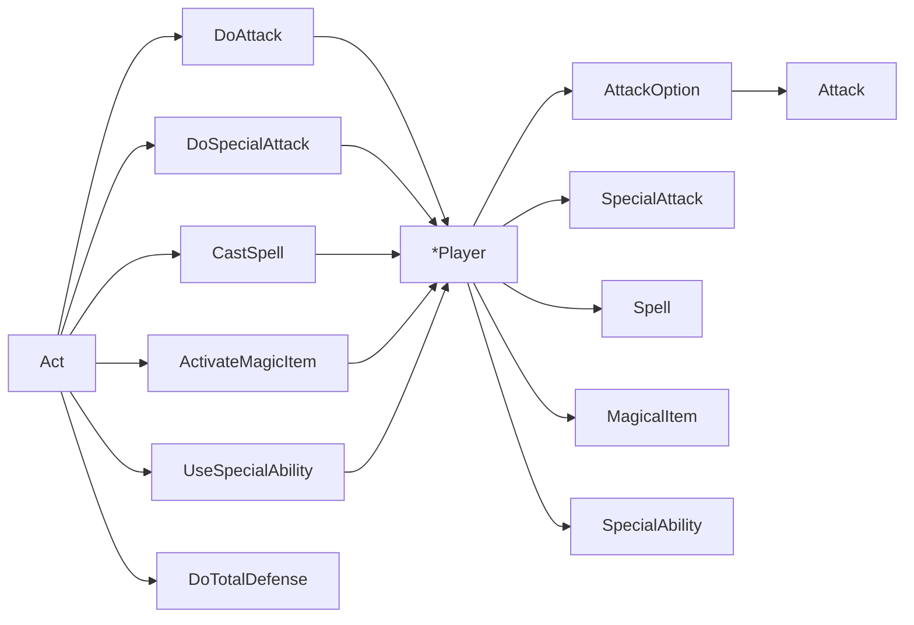

# Mixed entity and class (functional) diagram

```mermaid
graph LR
  CP[CombatParticipant] --> Act((Act))
  Act --> Effect((Effect))
  Effect --> CP
```

Actions

```mermaid
graph LR
  Act[Act] --> DoAttack
  Act --> DoSpecialAttack
  Act --> CastSpell
  Act --> ActivateMagicItem
  Act --> UseSpecialAbility
  Act --> DoTotalDefense
  DoAttack --> Player[*Player] --> AttackOption --> Attack
  DoSpecialAttack --> Player --> SpecialAttack
  CastSpell --> Player --> Spell
  ActivateMagicItem --> Player --> MagicalItem
  UseSpecialAbility --> Player --> SpecialAbility

```