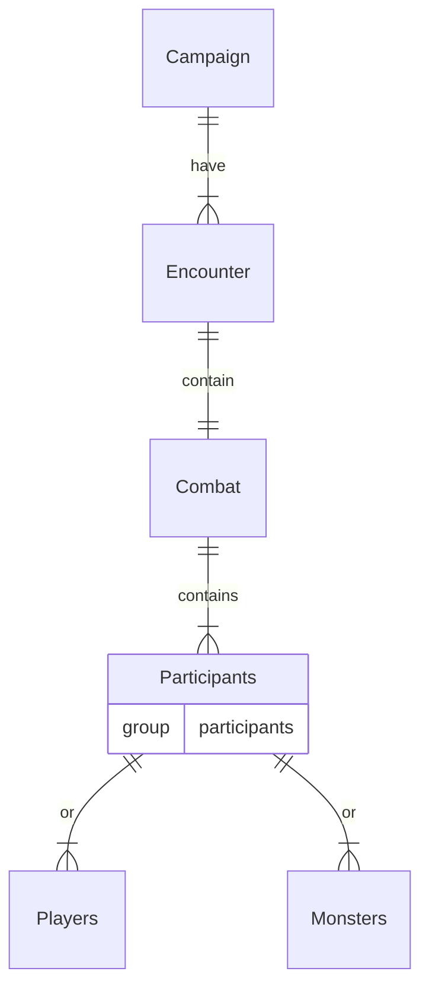
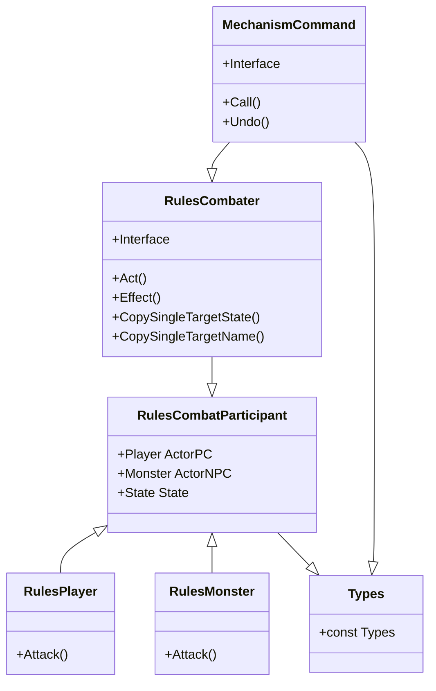

# relationship diagrams

```mermaid
erDiagram
  Campaign ||--|{Encounter : have
  Encounter ||--||Combat: contain
  Combat ||--|{Participants: contains
  Participants {
    group participants
  }
  Participants ||--|{Players: or
  Participants ||--|{Monsters: or
```

not a class diagram, but is a package/struct|interface diagram

```mermaid
classDiagram
  class MechanismCommand{
    +Interface 
    +Call()
    +Undo()
  }
  class RulesCombater{
    +Interface 
    +Act()
    +Effect()
    +CopySingleTargetState()
    +CopySingleTargetName()
  }
  MechanismCommand --|> RulesCombater
  class RulesCombatParticipant{
    +Player ActorPC
    +Monster ActorNPC
    +State State
  }
  RulesCombater --|> RulesCombatParticipant
  RulesCombatParticipant <|-- RulesPlayer
  RulesCombatParticipant <|-- RulesMonster
  class RulesMonster {
    +Attack()
  }
  class RulesPlayer {
    +Attack()
  }
  class Types {
    +const Types
  }
  RulesCombatParticipant --|> Types
  MechanismCommand --|> Types
```