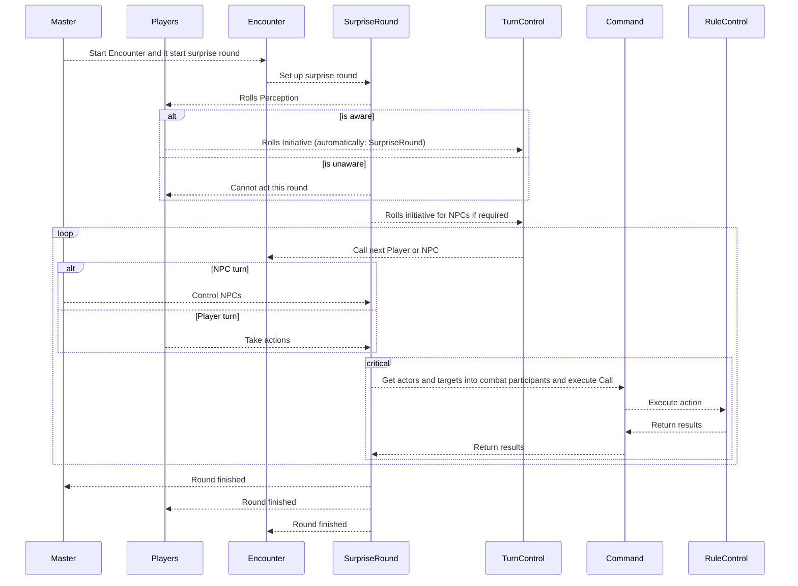
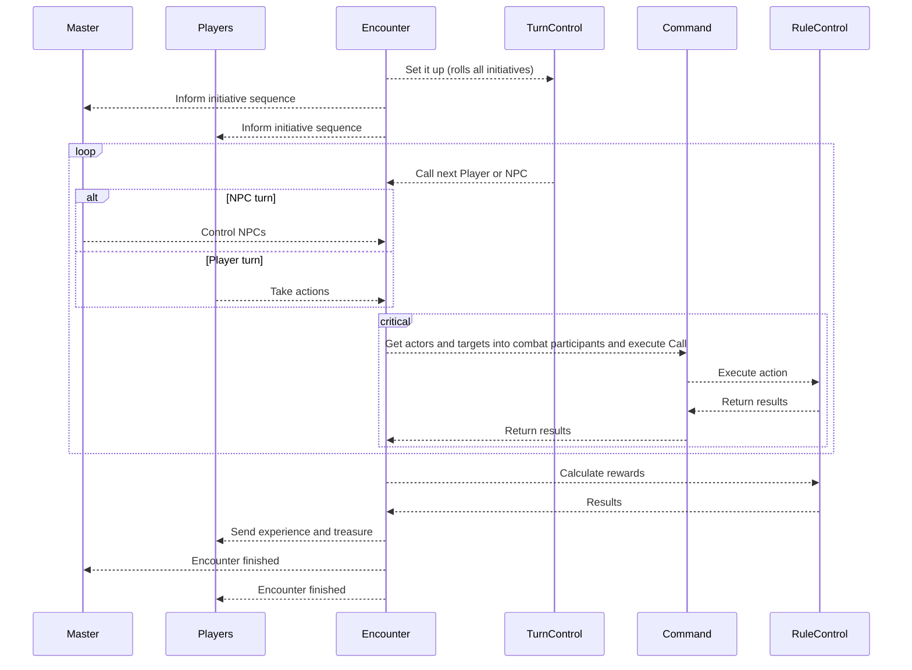

# sequences

## combat flow

### Surprise Round

```mermaid
sequenceDiagram
    participant Master 
    participant Players 
    participant Encounter
    participant SurpriseRound
    participant TurnControl
    participant Command
    participant RuleControl

    Master-->>Encounter: Start Encounter and it start surprise round
    Encounter-->>SurpriseRound: Set up surprise round
    SurpriseRound-->>Players: Rolls Perception
    alt is aware
        Players-->>TurnControl: Rolls Initiative (automatically: SurpriseRound)
    else is unaware
        SurpriseRound-->>Players: Cannot act this round
    end
    SurpriseRound-->>TurnControl: Rolls initiative for NPCs if required
    loop
        TurnControl-->>Encounter: Call next Player or NPC
        alt NPC turn
            Master-->>SurpriseRound: Control NPCs
        else Player turn
            Players-->>SurpriseRound: Take actions
        end
        critical
            SurpriseRound-->>Command: Get actors and targets into combat participants and execute Call
            Command-->>RuleControl: Execute action
            RuleControl-->>Command: Return results
            Command-->>SurpriseRound: Return results
        end
    end
    SurpriseRound-->>Master: Round finished
    SurpriseRound-->>Players: Round finished
    SurpriseRound-->>Encounter: Round finished
```

### Combat Rounds

```mermaid
sequenceDiagram
    participant Master 
    participant Players 
    participant Encounter
    participant TurnControl
    participant Command
    participant RuleControl

    Encounter-->>TurnControl: Set it up (rolls all initiatives)
    Encounter-->>Master: Inform initiative sequence
    Encounter-->>Players: Inform initiative sequence
    loop
        TurnControl-->>Encounter: Call next Player or NPC
        alt NPC turn
            Master-->>Encounter: Control NPCs
        else Player turn
            Players-->>Encounter: Take actions
        end
        critical 
            Encounter-->>Command: Get actors and targets into combat participants and execute Call
            Command-->>RuleControl: Execute action
            RuleControl-->>Command: Return results
            Command-->>Encounter: Return results
        end
    end
    Encounter-->>RuleControl: Calculate rewards
    RuleControl-->>Encounter: Results 
    Encounter-->>Players: Send experience and treasure
    Encounter-->>Master: Encounter finished
    Encounter-->>Players: Encounter finished
```

## investigation flow