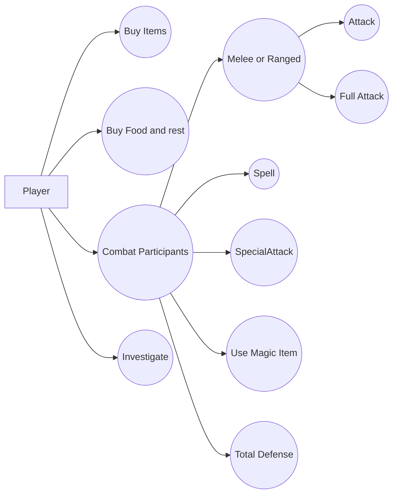
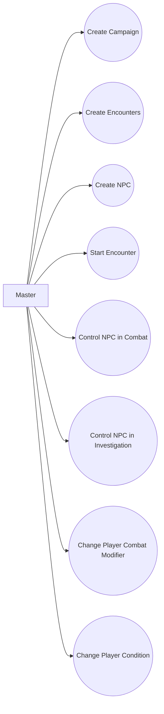

# usecases

## player

```mermaid
graph LR
    P[Player] --> A((Buy Items))
    P[Player] --> B((Buy Food and rest))
    P[Player] --> C((Combat Participants))
    P[Player] --> D((Investigate))
    C --> E((Melee or Ranged))
    C --> F((Spell))
    E --> G((Attack))
    E --> H((Full Attack))
    C --> I((SpecialAttack))
    C --> J((Use Magic Item))
    C --> L((Total Defense))
```

## master

```mermaid
graph LR
    P[Master] --> A((Create Campaign))
    P[Master] --> B((Create Encounters))
    P[Master] --> C((Create NPC))
    P[Master] --> D((Start Encounter))
    P[Master] --> E((Control NPC in Combat))
    P[Master] --> F((Control NPC in Investigation))
    P[Master] --> G((Change Player Combat Modifier))
    P[Master] --> H((Change Player Condition))

```